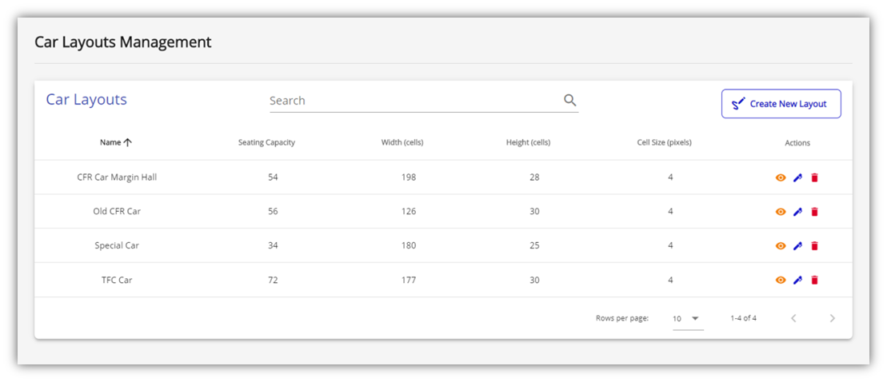

# Online Train Ticket Reservation

**Online Train Ticket Reservation** (*OTTR*) is a web platform for train ticket booking 
where customers can visually choose their seats, this representing the main feature. Other 
features include:
- Account registration, authentication and management;
- Rides filtering using different criteria;
- Payment for train tickets using **PayPal** and *SMS* confirmation;
- Easy car layouts and routes management for a qualified **railway administrator**;
- Many more...

The app consists of 2 components: **client** and **server**. The client was developed using
**Vue.js** while the server is based on **Node.js**. All data is stored inside a **MongoDB**
database so the app can be easily scalable regarding the data schemas. *OTTR* is also 
hosted on **Heroku** and can be easily accessed at:

https://ottr-reservation.herokuapp.com/

Feel free to create a new account and search for a ride from **Braila** to **Bucuresti Nord**
on **August 1st 2030**. To make a checkout using PayPal, you can use a sandbox PayPal account 
having the following credentials: (mail: **gabriel-griffin@gmail.com**, pwd: **G@br1el***). 
Note that the *SMS* confirmation feature has been disable since the **Nexmo API** that makes 
it possible has not been made available for free.

\
Table of Contents:
- [Entity Relationship Diagram](#entity-relationship-diagram)
- [Screenshots](#screenshots)
  - [Home Page](#home-page)
  - [Results Page](#results-page)
  - [My Account Page](#my-account-page)
  - [Ride Booking Page](#ride-booking-page)
  - [My Tickets Page](#my-tickets-page)
  - [SMS Confirmation](#sms-confirmation)
  - [Admin Pages](#admin-pages)
    - [Miscellaneous Page](#miscellaneous-page)
    - [Car Layouts Page](#car-layouts-page)
    - [Routes Page](#routes-page)
    - [Dashboard Page](#dashboard-page)

## Entity Relationship Diagram

## Screenshots

### Home Page

### Results Page

### My Account Page

### Ride Booking Page

### My Tickets Page

### SMS Confirmation

### Admin Pages

#### Miscellaneous Page

#### Car Layouts Page

#### Routes Page

#### Dashboard Page

